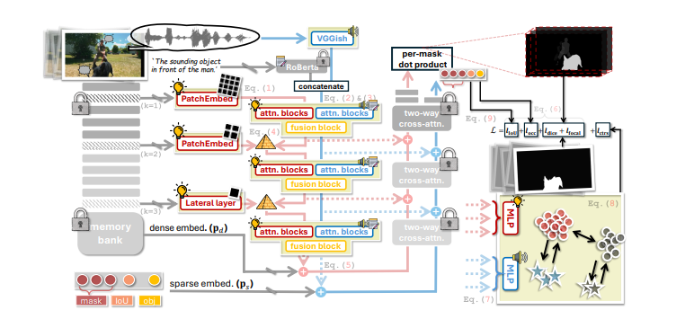

# AuralSAM2
> **[CVPRF'26]** [AuralSAM2: Enabling SAM2 Hear
Through Pyramid Audio-Visual Feature Prompting](#)
>
> by Yuyuan Liu, Yuanhong Chen, Chong Wang, Junlin Han, Junde Wu, Can Peng, Jingkun Chen, Yu Tian and Gustavo Carneiro
>


## Installation
please install the dependencies and dataset based on this [***installation***](./docs/installation.md) document.

## Getting start
please follow this [***instruction***](./docs/before_start.md) document to reproduce our results.

## Citation
please consider citing our work in your publications if it helps your research.

```bibtex
@article{liu2025auralsam2,
  title={AuralSAM2: Enabling SAM2 Hear Through Pyramid Audio-Visual Feature Prompting},
  author={Liu, Yuyuan and Chen, Yuanhong and Wang, Chong and Han, Junlin and Wu, Junde and Peng, Can and Chen, Jingkun and Tian, Yu and Carneiro, Gustavo},
  journal={arXiv preprint arXiv:2506.01015},
  year={2025}
}
```

